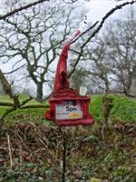
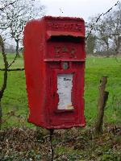
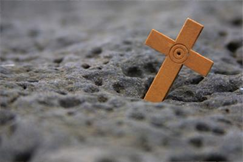
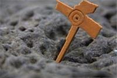
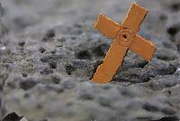

# Seam-Carving-Image-Processing
This is a project on image retargeting which was part of my research internship at IIT Delhi. 
I worked in this project along with my friends Ashutosh Rahi and Rakshit Sharma. We used object detection and image processing techniques to improve the Seam Carving algorithm (used in image retargeting). 
The image results obtained from our method were better than those obtained from the standard seam carving algorithm.    
1. 
original image   
  
Standard seam carving algorithm result  
  
The result from our method  
    
2. 
original image   
  
Standard seam carving algorithm result  
  
The result from our method  
  
